# Ablaufdiagramme - Energiewendesimulation

Diese Dokumentation enthält detaillierte Mermaid.js-Diagramme für alle Datenflüsse und Algorithmen.

---

## 1. Gesamtablauf der Anwendung

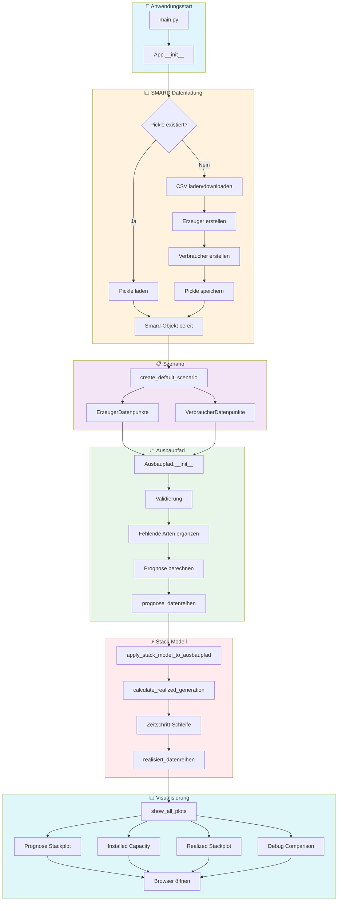

---

## 2. SMARD-Datenladung im Detail

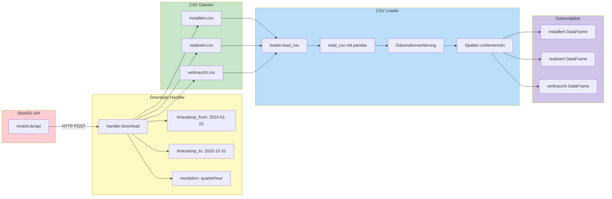

---

## 3. Datenstruktur eines Erzeugers

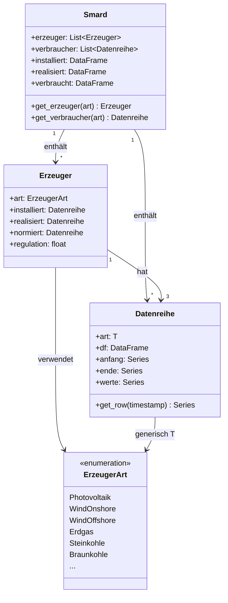

---

## 4. Normiertes Profil Berechnung

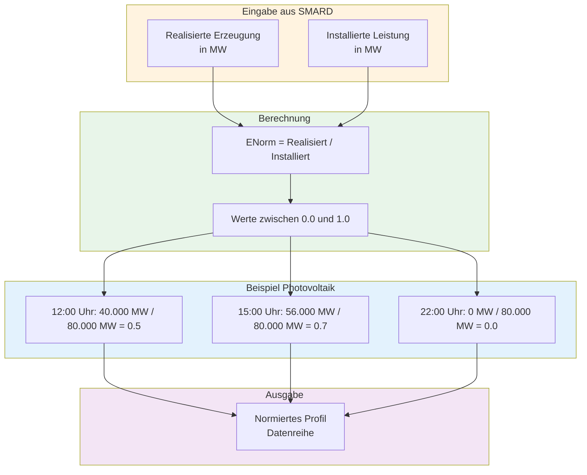

---

## 5. Szenario-Datenpunkte

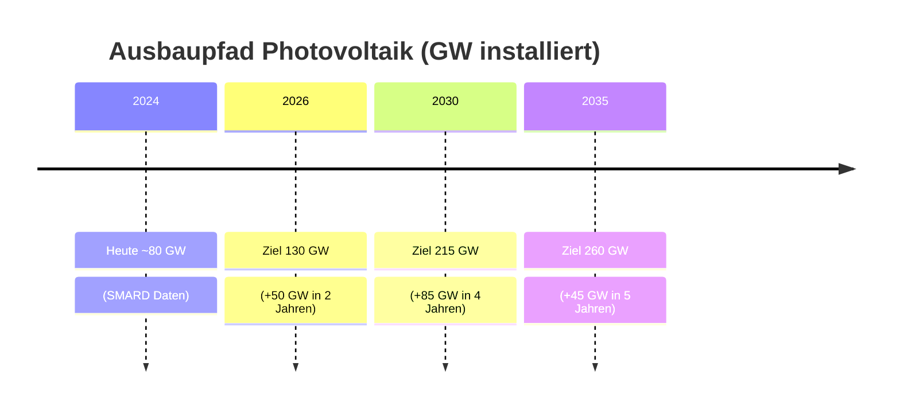

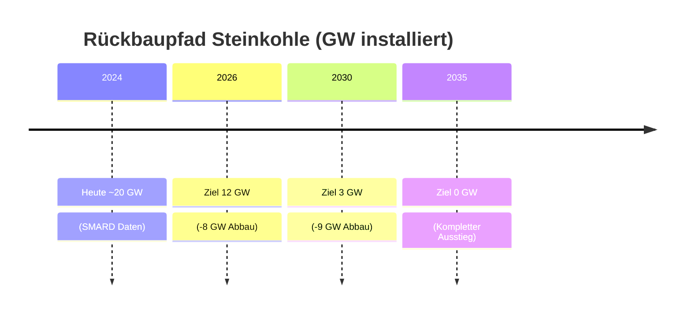

---

## 6. Ausbaupfad-Berechnung

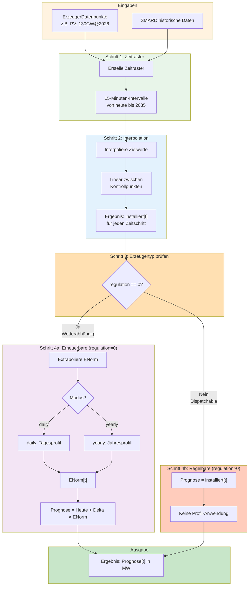

---

## 6b. Prognose-Berechnung: Erneuerbare vs. Regelbare

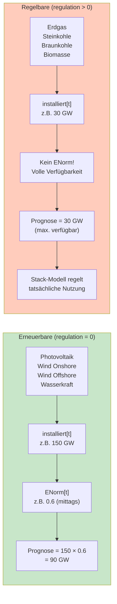

**Warum diese Unterscheidung?**
- **Erneuerbare** sind wetterabhängig → ENorm zeigt typische Erzeugungsmuster
- **Regelbare** können nach Bedarf gesteuert werden → Stack-Modell entscheidet über Einsatz

---

## 7. Stack-Modell Algorithmus

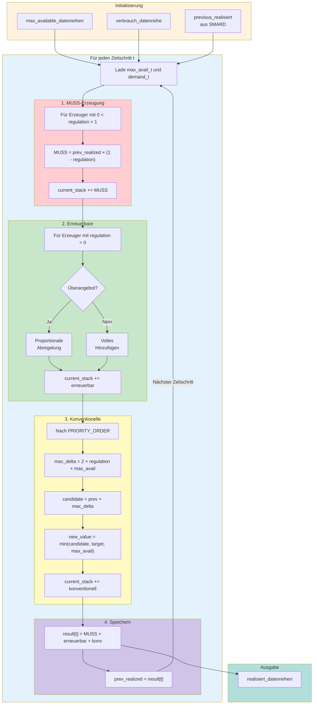

---

## 8. MUSS-Erzeugung im Detail

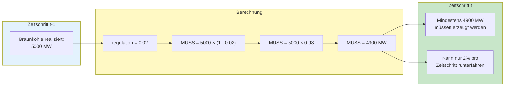

---

## 9. Proportionale Erneuerbare Abregelung

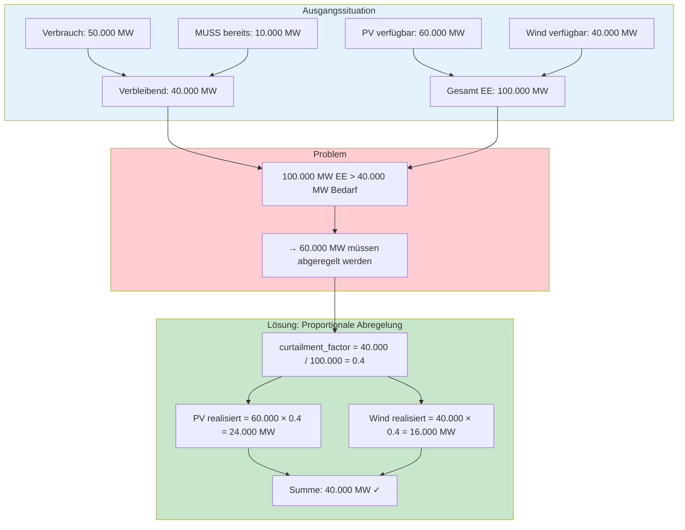

---

## 10. Konventionelle Hochfahren (Ramp-Rate)

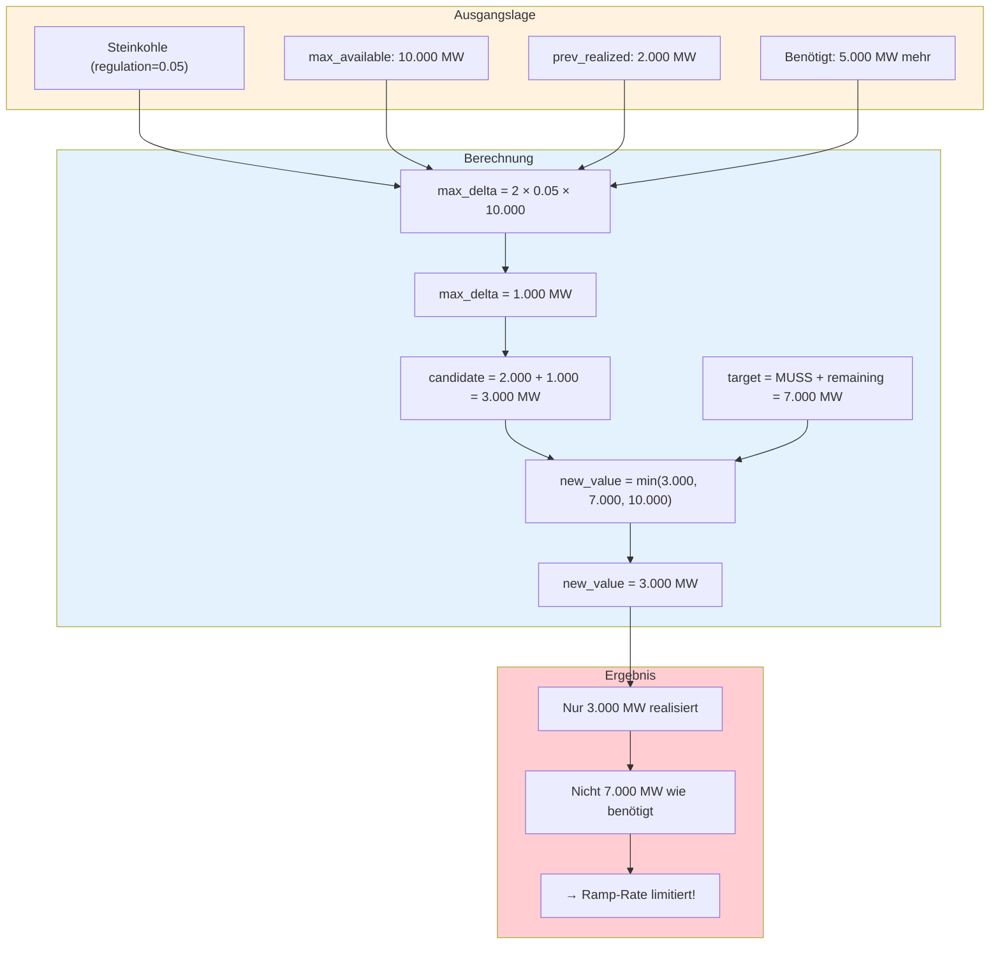

---

## 11. Visualisierungs-Pipeline

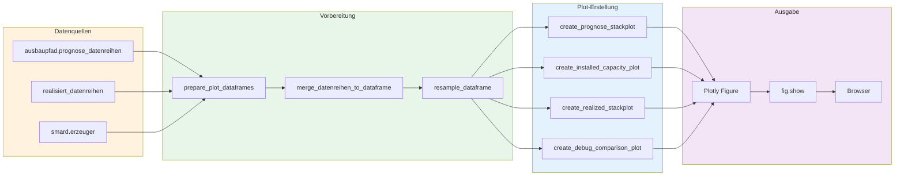

---

## 12. Datenfluss Gesamtübersicht

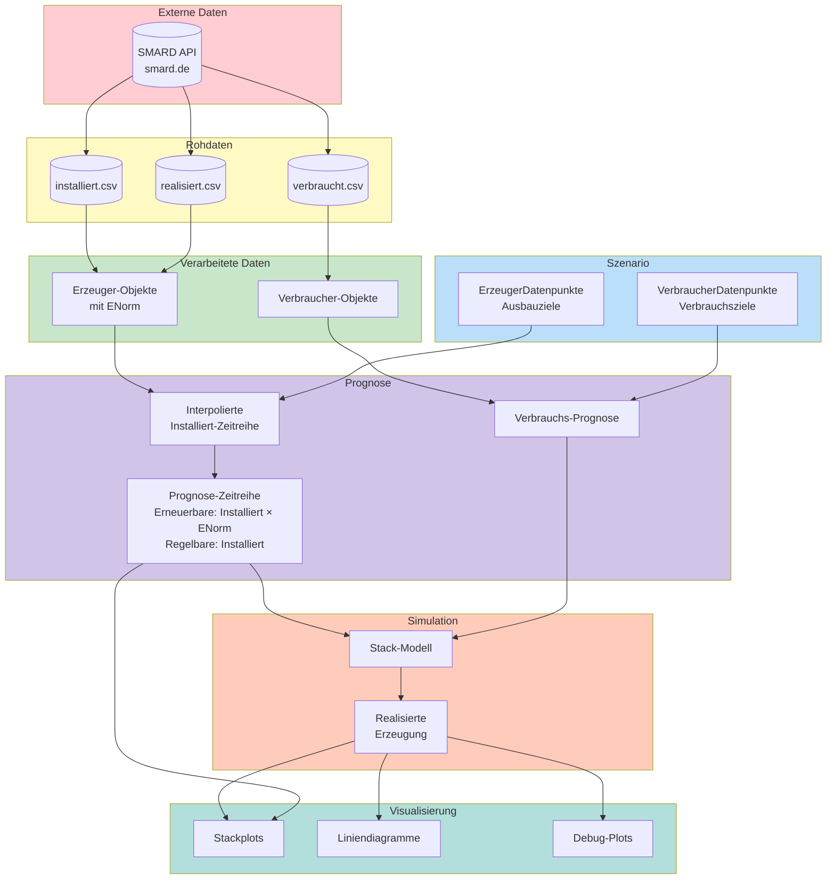

---

## 13. Zeitliche Auflösung

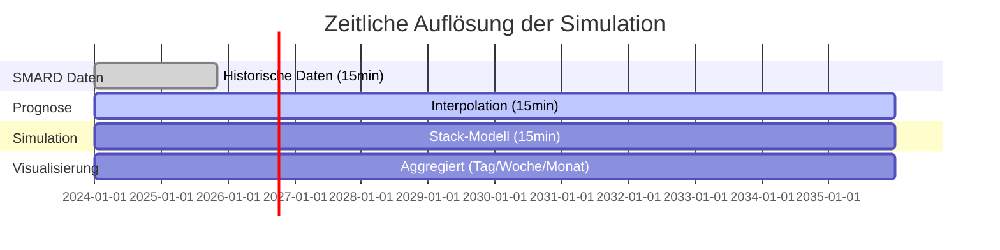

---

## Legende

| Symbol | Bedeutung |
|--------|-----------|
| 🟡 Gelb | Rohdaten / Eingabe |
| 🟢 Grün | Verarbeitung / Berechnung |
| 🔵 Blau | Zwischenergebnisse |
| 🟣 Lila | Prognose / Simulation |
| 🔴 Rot | Probleme / Limitierungen |
| 🩵 Türkis | Ausgabe / Visualisierung |

---

*Diagramme erstellt mit Mermaid.js - Dezember 2024*

